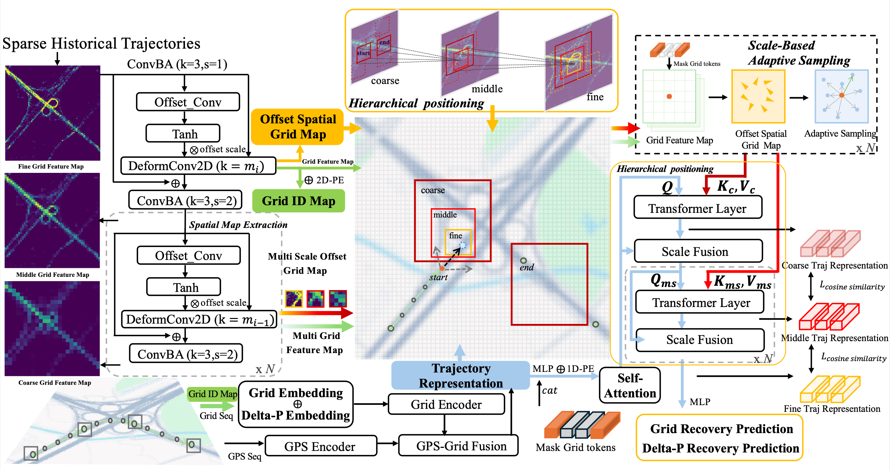

# Region-aware Hierarchical Trajectory Recovery model
we propose Region-aware Hierarchical Trajectory Recovery (RHTR) model, designed for location inference and trajectory recovery in sparse, roadless environments.

## Code
If the paper gets accepted, I will release the related code.

## Model Visualization
Here's a diagram illustrating the RHTR architecture:

